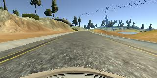
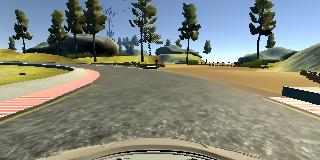
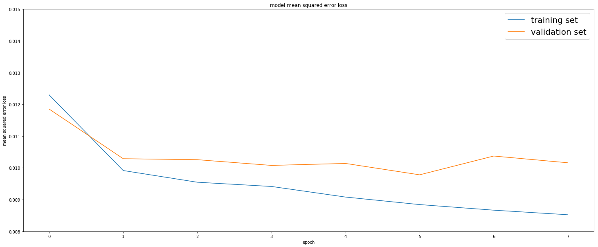

# Project 3 - Behavioral Cloning

## Objective

The objective of this project was to use deep learning to clone driving behavior and enable a simulated car to go around a simulated test track.

## Approach

### Training Data

The first stage of the project involved collecting data that would be used to train a neural network. 

A driving simulator was provided where a simulated car was able to drive  around a test track. In training mode, an image was recorded from 3 positions at the front of the car (left, center and right) in addition to steering, throttle, brake and speed data as the simulated car traversed around a test track.

For this project, I used only the center images like those shown here.

Also collected was the steering data. The steering data was the variable that needed to be predicted when running in autonomous mode. 

I created my own data set using the simulator to drive around the course a number of times.

To help the model generalize better, each image with its associated steering value was flipped horizontally and added into the final data set. 

I also generated some "recovery data" by positioning the car at the edge of the track and then recording recovering back to the center of the road. Extra samples of the car going around the various corners were also collected. 

However, with this data I found that the car would not traverse the track completely in autonomous mode. 

To double check my models, I downloaded the Udacity supplied data and was able to complete a circuit of the test track. So this data was used for the final test. The supplied data was augmented with the images flipped horizontally. 

### Model Architecture

Initially, the images were cropped to remove spurious data from the upper half of the image which contained mostly sky and landscape. The hood of the car in the lower part of the image was also cropped out. 

Next, the data were normalized to give a mean of 0 and a standard deviation of 1.

This resulting data were then fed into the neural network. The architecture chosen for this network was the NVIDIA model described in this [blog post](https://devblogs.nvidia.com/parallelforall/deep-learning-self-driving-cars/) and [paper](https://arxiv.org/pdf/1604.07316v1.pdf).

The following image is from the NVIDA paper:-

The model used for this project comprises 

| Layer Type | Details |
|:---:|:---:|
|Cropping| Remove upper and lower part of image|
|Normalization| Mean of 0 and standard deviation of 1|
|Convolutional| Depth = 24, filter = 5 x 5, stride = 2 |
|Dropout layer| 0.2|
|Convolutional| Depth = 36, filter = 5 x 5, stride = 2 |
|Dropout layer| 0.2|
|Convolutional| Depth = 48, filter = 5 x 5, stride = 2 |
|Dropout layer| 0.2|
|Convolutional| Depth = 64, filter = 3 x 3, stride = 1 |
|Dropout layer| 0.2|
|Convolutional| Depth = 64, filter = 3 x 3, stride = 1 |
|Max pooling layer| 0.2|
|Dropout layer| 0.2|
|Flatten|to 1162 Neurons |
|Fully Connected | 100 Neurons |
|Fully Connected | 50 Neurons |
|Fully Connected | 10 Neurons |
|Output|Single output node yielding the predicted steering angle|

#### Model Changes

The NVIDIA paper did not mention drop out or pooling.

The model used in this project added dropout layers after each of the convolutional layers and added max pooling after the last convolution layer.

#### Activation Function

There was no mention of the activation function used in the NVIDIA paper. For this project I experimented with ELU but found that slightly better results were obtained when using a ReLU activation function.  

#### Optimizer and Loss

The optimizer used in this project was the Adam optimizer.

To calculate the loss, mean squared error (MSE) was utilized.

### Other Considerations

As part of the project brief, it was recommended to use a **fit generator** for image processing. However, on my PC I found that this was not necessary given the amount of data I was processing and the amount of available memory at my disposal.

During testing of the model, I did run into a problem where the error CUDNN_STATUS_INTERNAL_ERROR was encountered. I had to modify the drive.py file to limit the amount of memory TensorFlow & Keras were using on the GPU. During testing of some earlier models, I also had to limit the memory in my model.py file. In the final model using the Udacity supplied data this was not required.

## Training and Results

During training, the data was shuffled and split into a training and validation set with 20% used for validation.  A test set was not created as the result would be tested using the simulator. 

The model was trained for 8 epochs.

Using the model described here, the training loss was approximately 0.009 and the validation was approximately 0.01. From the following chart it appears that training for 6 epochs could achieve a desirable result.

## Simulator Results

Using the NVIDIA architecture with augmented data as described above, the car was able to complete a circuit of the test track autonomously. At no time during the test run did the car pop up onto any ledge or drive onto any of the undrivable surfaces. 

A video of the test run can be observed on [Github](https://github.com/dvd940/Udacity_Self-Driving_Car/tree/master/Project3).

## Future Project Enhancements

There are a number of steps that could be taken in the future to enhance the model. 

* More data could be collected by driving on the advanced simulator track. Collecting such data could help the model generalize more. 
* The NVIDIA paper talks about converting the images to the YUV color space. Other color spaces including monochrome could also be experimented with.
* Image processing such a Gaussian blur could be added to reduce noise. 
* The NVIDIA paper mentions adding random artificial image shifts and rotations to the data to help recovery from poor positions or orientation. 

## Project Code

The code for for this project is available on [Github](https://github.com/dvd940/Udacity_Self-Driving_Car/tree/master/Project3).